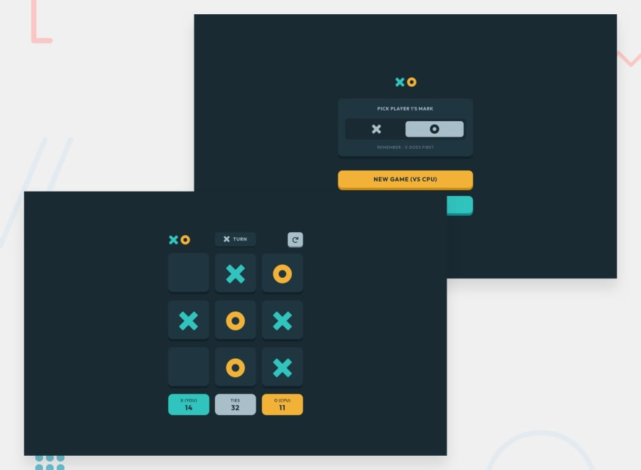

# GAME OF 'TIC-TAC-TOE'
This project is a 'premium' challange (that I do not have access to) on frontendmentor. Not having the premium account means that I can not access image/design/notes files. So I am going to be following only their requirements for the app.

### DESIGN IDEA

### REQUIREMENTS:
#### USERS SHOULD BE ABLE TO:
- View the optimal layout for the game depending on their device's screen size
- See hover states for all interactive elements on the page (going to make them up myself)
- Play the game either solo vs the computer or multiplayer against another person
- **Bonus 1:** Save the game state in the browser so that it’s preserved if the player refreshes their browser
- **Bonus 2:** Instead of having the computer randomly make their moves, try making it clever so it’s proactive in blocking your moves and trying to win

#### SOLUTIONS: 
- For game logic I am going to be using something called "magic square": https://mathworld.wolfram.com/MagicSquare.html
